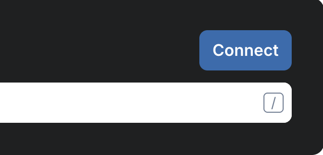

# 🦊 Connect to HPP

### HPP Sepolia (Testnet)

#### 🦊 Metamask

To add HPP Sepolia as a custom network from Block explorer easy:

1. Visit [Sepolia(testnet) Block explorer](https://sepolia-explorer.hpp.io/)
2.  Click the **Connect button** at the top right.

    \

To add HPP Sepolia as a custom network to MetaMask manually:

1. Open the **MetaMask** browser extension.
2. Open the **network selection dropdown menu** by clicking the dropdown button at the top of the extension.
3. Click the **Add network** button.
4. Click **Add** a network manually.
5. In the Add a network manually dialog that appears, enter the [Network Information](network-information.md)
6. Tap the **Save** button to save HPP Sepolia as a network.

You should now be able to connect to the HPP Sepolia testnet by selecting it from the network selection dropdown menu.

### Import HPP Token

To import HPP token to Metamask:

1. Open the MetaMask browser extension.
2. Click the drop-down menu at the top right of the token list screen below, then click **`+ Import Token`**.
3. Select the network “HPP Sepolia” added above.
4. Enter the HPP token contract address : \
   `0x9882e5DFfd3440BA5C94D01ef13F544743F2Ce94` \
   clicking **Next button**.
5. After confirming the Token Symbol **HPP** and Decimal **18**, click the **Next button**.
6. Click **Import** to complete.

If you want to add  tokens more, please visit to [Token Address](hpp-contracts.md).

